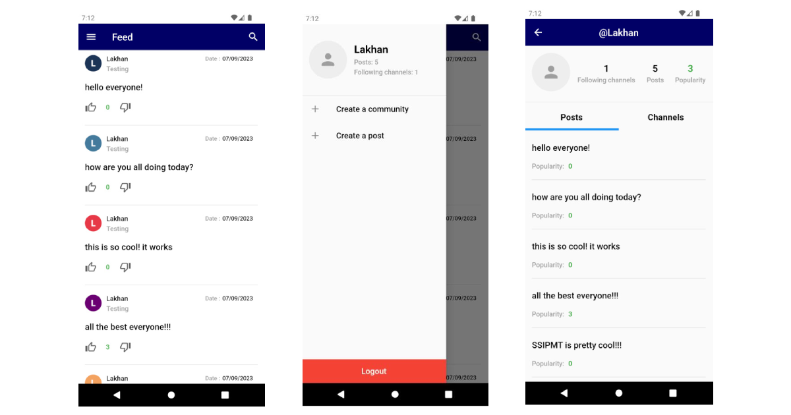

# Impulse : Social Media

- backend:
  - nextJS for public API -> vercel hosting
  - mongoDB -> mongoDB atlas hosting
- frontend:
  - flutter -> apk

## Features:
- auth: username & password
- channels: create communities, follow/unfollow
- posts: create post for specific channel, upvote/downvote, delete
- views:
  - homefeed: all following channel posts
  - channelfeed: all posts in a channel
  - profilefeed: posts made by user

### project by:

- [@shreydan](https://github.com/shreydan)
- [@1akhanBaheti](https://github.com/1akhanBaheti/)
- [@LavanyaG23](https://github.com/LavanyaG23)

### Screenshots:

